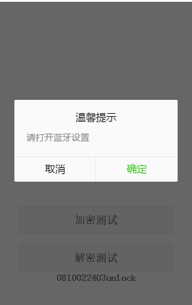
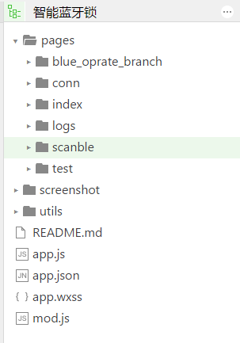

# 智能蓝牙锁微信小程序技术文档

##  1，开发环境 

    微信开发者工具   0.20.191900             
    
##  2，运行步骤  
    
    1，打开微信开发者工具 -> 新建小程序项目
    2，配置当前小程序的appId(备注：只有配置此选项才能够在手机上进行预览)
    3，新建项目目录，选择项目目录并确定
    4，配置小程序的域名以及Https协议
    
##  3，展示
 

##  4，项目结构

